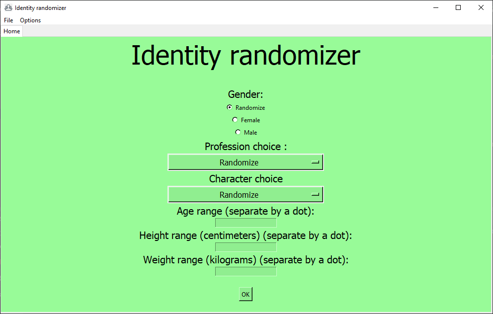

# Identity randomizer
[French README](README_french.md)

Program who randomly generate persons.

Work with **Python 3.10**. (available on https://python.org/downloads) (not necessary if you have a compiled copy of the program)

# Instructions
## First start
Launch main.py (or main.exe if you have a compiled copy of the program)
* You should have this window : 
* 
* Select your language with the option menu. You can choose French (Français) or English.
* You can make it by default by checking the box. The window will not open each time if you do that.
* Then click 'OK'.

## Home
You should have this window :

### Gender
You can choose the gender : random (randomly chosen by the program), female or male.

Non-binaries are not implemented yet.

### Profession and character
You can choose profession and character with the option menus. To display all the list, you have to click on the arrows at the top and the bottom of the choices.

### Ranges
You can let the boxes empty. If you fill them, put the MIN value and the MAX value like this : `MIN.MAX`. If MIN=MAX, you can just put `MIN` or `MAX`.

## Generate a person
When you completed the form, you can click on "OK" (maybe that the button is "submit this form".)

A new tab opened with the person generated.

NOTE: The first names and the names are all from a FRENCH database, so they sound French. Sorry :/

## Save & open
You can save the person if you want. Just click on the 'save' button, then save wherever you want.

To open your files, go to `File>Open` or hit `Ctrl+O` (even under MacOS)
