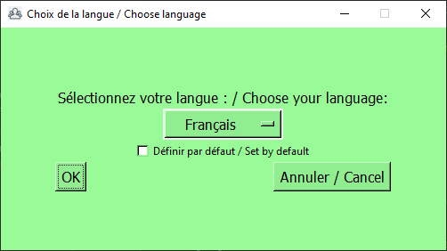
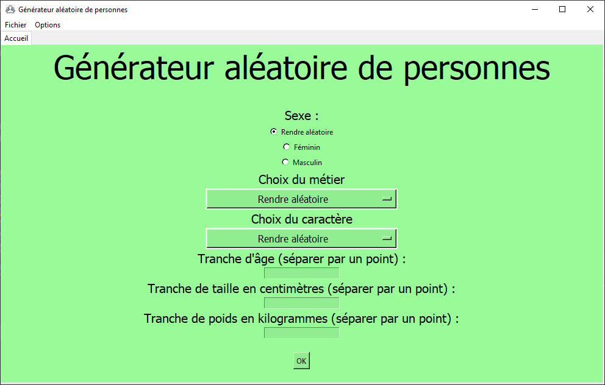

# Générateur de personnes
[README en Anglais](README.md)

Programme qui génère aléatoirement des gens.

Nécessite **Python 3.10**. (disponible sur https://python.org/downloads) (non nécessaire quand vous avez une version compilée)

# Instructions
## Premier démarrage
Lancez main.py (ou main.exe si vous avez une version compilée)
* Vous devriez avoir cette fenêtre : 
* 
* Sélectionner votre langue avec le menu déroulant. Vous pouvez choisir Français ou Anglais.
* Vous pouvez faire de cette langue la langue par défaut si vous cochez la case. Cette fenêtre ne s'affichera plus au démarrage.
* Cliquez sur 'OK'.

## Accueil
Vous devriez avoir cette fenêtre :

### Sexe
Vous pouvez choisir le sexe de la personne : soit homme, soit femme, soit l'un des deux aléatoirement.

Les non-binaires ne sont pas encore implémentés.

### Métier et caractère
Vous pouvez choisir le métier et le caractère avec les menus déroulants. Pour afficher toute la liste, vous devez cliquer sur les flèches en haut et en bas de celle ci. 

### Tranches
Vous pouvez laisser les boîtes vides. Si vous les remplissez, mettez les valeurs MIN et MAX de cette façon : `MIN.MAX`. Si MIN=MAX, mettez simplement `MIN` ou `MAX`.

## Générer une personne
Quand vous avez rempli le formulaire, vous pouvez cliquer sur "OK" (dans le bouton s'affiche peut-être le texte "soumettre ce formulaire".)

Un nouvel onglet s'ouvre dans lequel la personne générée est décrite.

Les prénoms et noms ne sont disponibles qu'en FRANÇAIS

## Sauvegarder & ouvrir
Vous pouvez sauvegarder une personne si vous le souhaitez. Pour ce faire, cliquez sur le bouton 'sauvegarder', puis sauvez-le où vous le souhaitez.

Pour ouvrir vos fichiers, allez dans `Fichier>Ouvrir` ou faites `Ctrl+O` (même sous MacOS)
